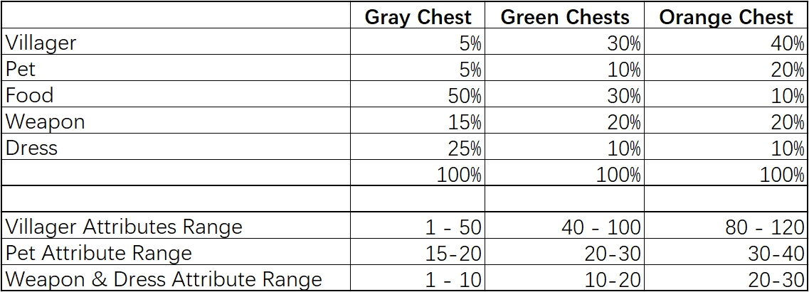

# Chests

There are 3 different Chests, and different Chests have different ratios of getting different items and also affect the attribute range of your items.

**Gray Chest** can be obtained from exploring, or player can receive free Gray Chests from our marketing campaign.&#x20;

**Green Chests** can be purchased directly from the Market, or through exploring, it’s rare to get through exploring, it’s better to have 100% happiness of your villager and equip him well before sending him out.

**Orange Chest** can’t be collected through exploring, it’s only available through our marketing activities.

Green Chest is rare, the odds of getting Green Chests increases when players open more chests collected in one single exploration. The more chests you collected, the more chances you can get a green chest.
