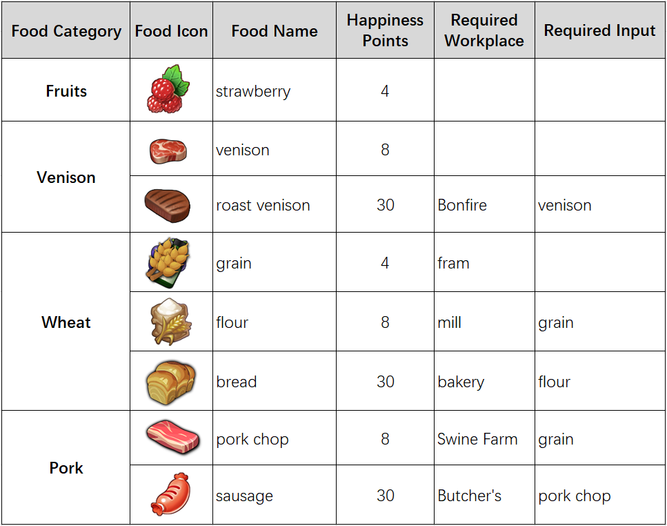

# Foods

There are 4 different food types, foods can be collected, hunted or produced by different workplaces, and each of different foods has different happiness points.

Some foods required [workplaces ](workplaces-and-tools.md)and consume inputs to produce the foods. The workplaces consume inputs automatically and players can harvest the foods to the warehouse. The workplaces stops if there isn’t enough inputs in the warehouse.

