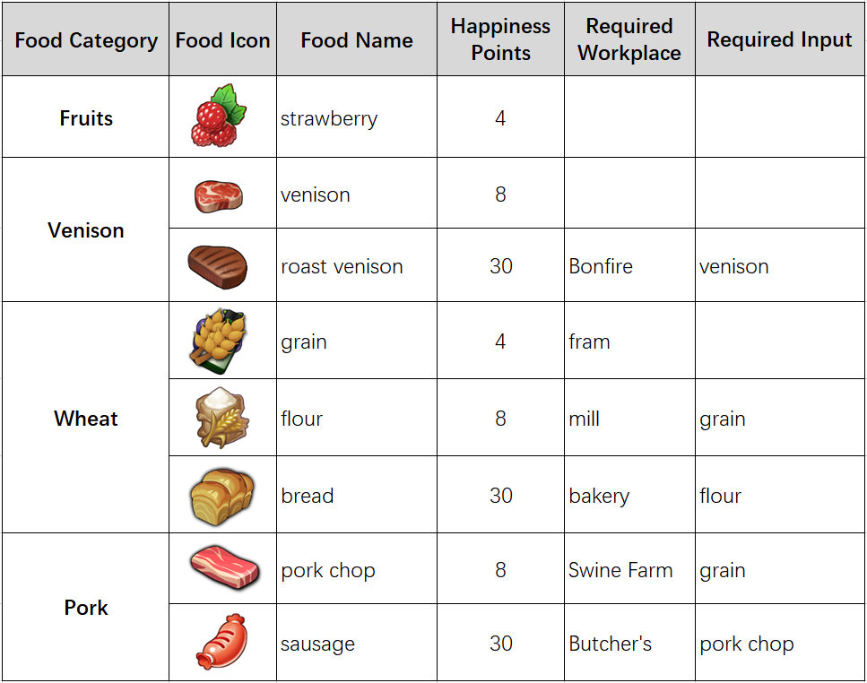

# Happiness

Villager's Happiness is very important, as it results in different efficiency of the villager to perform his/her job. Each villager has 100 maximum happiness points, which eating different foods will increase the same amount of Happiness. **Happiness equals the villager’s working efficiency**, you’d better make the villager happy before assigning a job to him/her.

Players can feed the villager 1 food from each food category only, for example, a player can feed a villager grain and then the player can’t feed the villager bread anymore.

The calculation of the villager’s Happiness: Base Points (10 points) + fed foods points

Player doesn’t have to worry a villager got nothing returned, the villager will continue to work, until he gets a successful hunt or collects a Chest.

