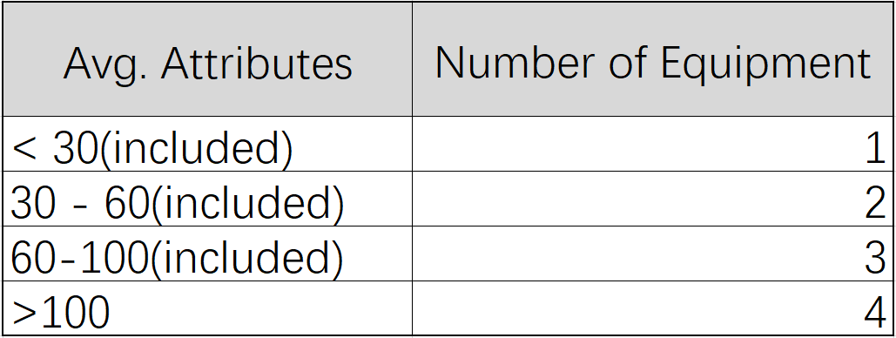

# Villager Equipment

When players collect NFTs from opening chests, the villager can wear them right away, to increase the villager’s attributes. Currently, each villager can equip items to head, body, legs and feet, one weapon, one tool and one pet at the same time.

There are a few rules for wearing villager’s equipment. villager’s average attributes will affect how much equipment the villager can have. Once the villager equips or unquips wearables, his attributes are changed too.

