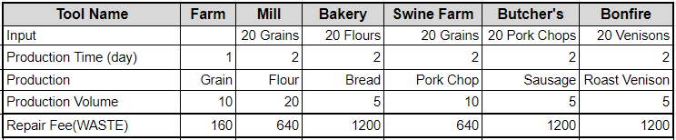

# Staking Incentive

Tokens allocated for staking incentives are emitted based on a pre-defined schedule as described in the following table.

WASTE staking rewards per block of Staker A are calculated by:

      _WASTE staked by Staker A / Total staked WASTE in the pool \* WASTE per block_

Example:

Staker A stakes 10,000 WASTE during Phase A The total amount of staked WASTE at the calculation time is 1,000,000

Based on the above assumptions, Staker A will receive staking rewards:

10,000 / 1,000,000 \* 240 = 2.4 WASTE per block

The Wasteland Settlers enables auto-compounding for all stakers who deposit WASTE to the staking pool. This means that WASTE token rewards received from the staking are automatically re-staked into the pool.

Tokens received from staking incentives can be withdrawn from the staking pool at any time to a staker’s wallet for use in the game or trading on an exchange.
